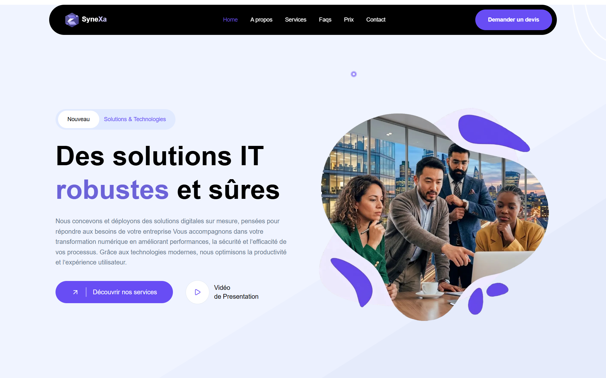
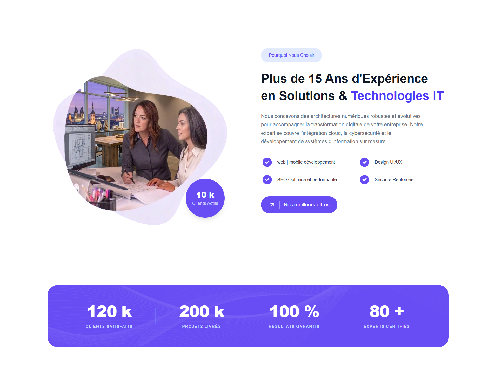
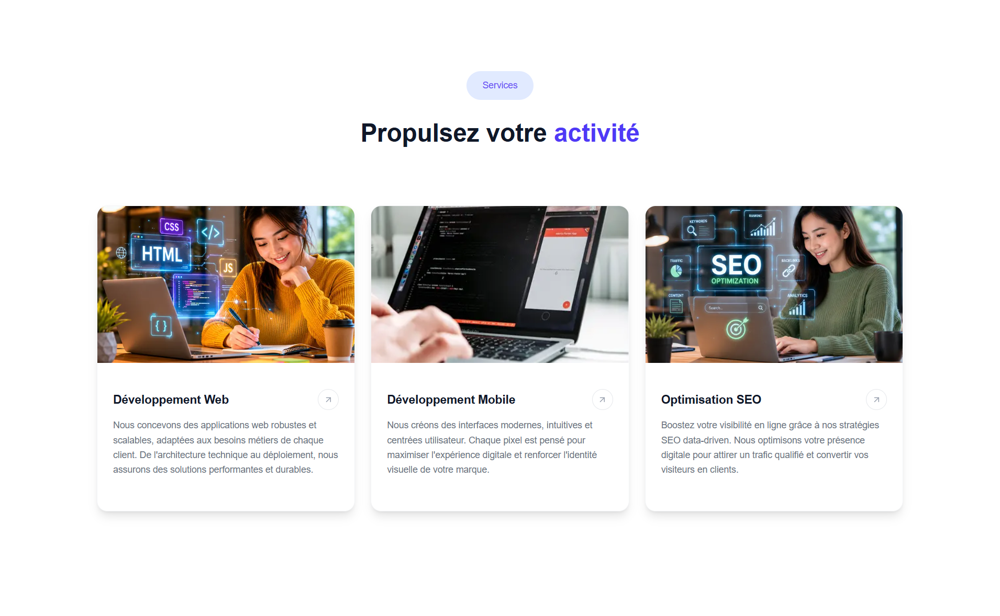
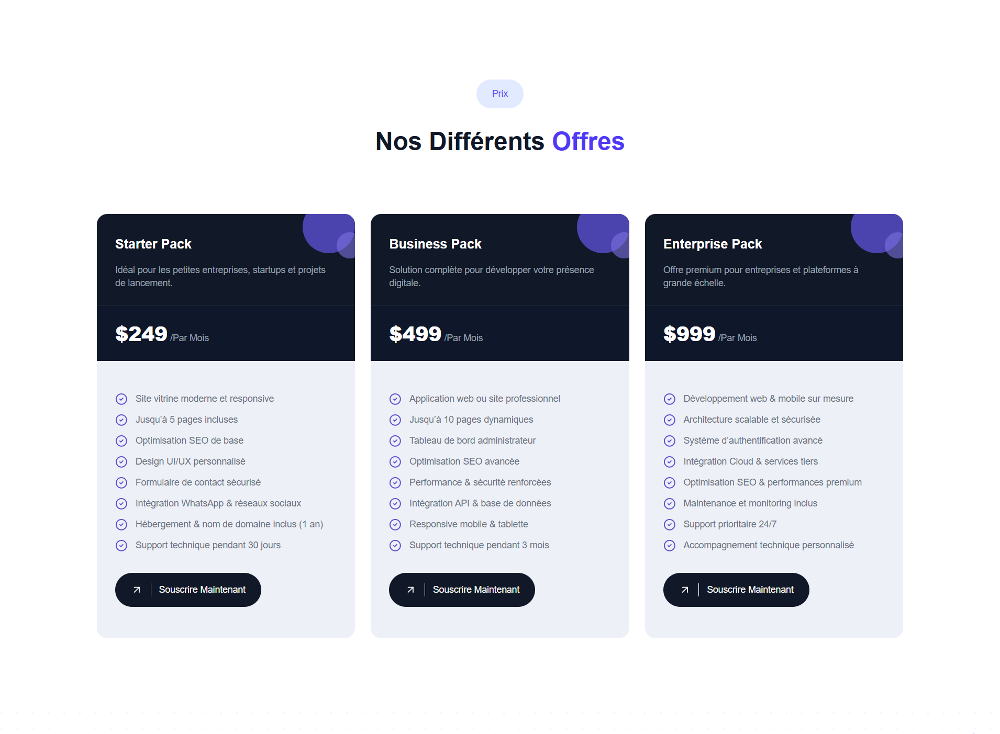
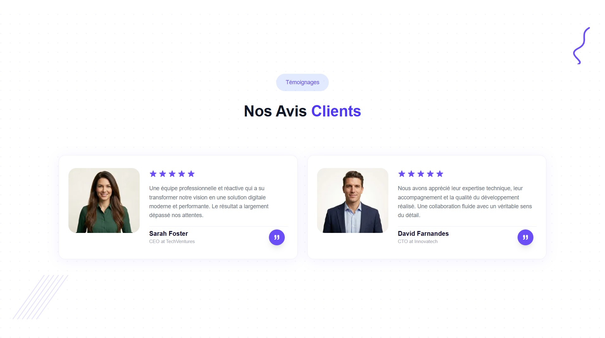
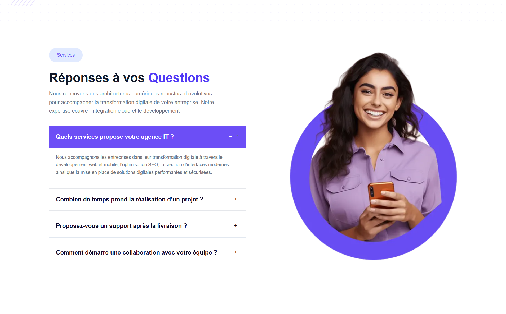
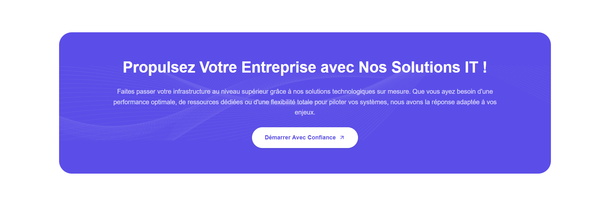
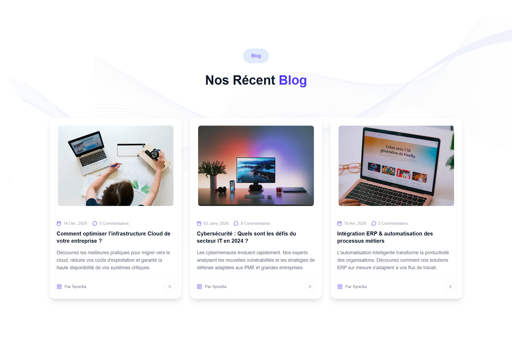
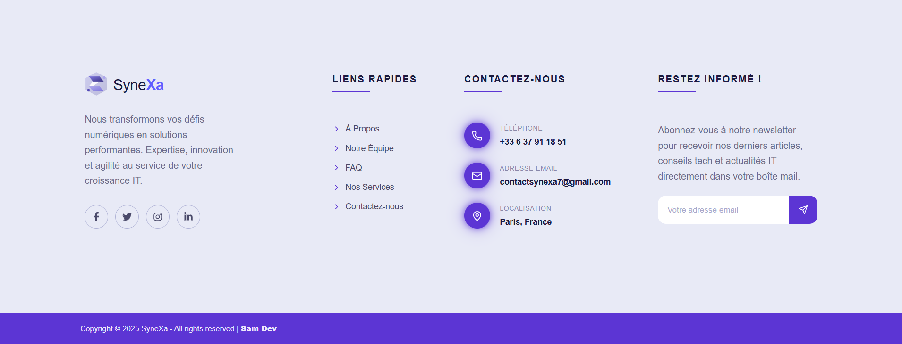

# SyneXa — Site Vitrine Solution & Technologies IT (Next.js)

**SyneXa**, un site vitrine moderne et responsive dédié aux solutions digitales, au développement web & mobile ainsi qu’à l’optimisation SEO.


## À propos

Ce site a été conçu pour présenter une agence IT moderne, mettre en avant ses domaines d’expertise et permettre aux entreprises de découvrir facilement ses services et de prendre contact rapidement.


## Objectifs du projet

* Présenter des solutions digitales modernes
* Valoriser l’expertise et le positionnement professionnel de l’agence
* Mettre en avant les services, témoignages et offres tarifaires
* Convertir les visiteurs en prospects grâce à une interface optimisée

**Note :** responsive et compatible sur mobile, tablette et ordinateur.


## Technologies utilisées

* **Next.js / React.js** — Framework moderne et performant
* **Tailwind CSS** — Design responsive et optimisé
* **TypeScript** — Code robuste et maintenable
* **Framer Motion** — Animations fluides et modernes


## Fonctionnalités

* Page d’accueil moderne et responsive
* Section **Navbar**
* Section **Hero**
* Section **À propos**
* Section **Services**
* Section **Tarification**
* Section **FAQ**
* Section **Témoignages**
* Section **CTA**
* Section **Blog**
* Section **Footer**
* Design entièrement responsive
* Optimisation SEO de base
* Animations modernes et fluides


## Fonctionnalités à venir

* Ajout de nouvelles sections et fonctionnalités
* Formulaire de contact avancé
* Support multilingue
* Mode sombre


## Captures d’écran

| Hero | À propos |
|-------|-----------|
|  |  |

| Services | Equipe |
|-----------|---------------|
|  |  |

| Pricing | Témoignages |
|-----|--------------|
|  |  |

| FAQ | CTA |
|------|---------|
|  |  |

| Blog | Footer |
|------|---------|
|  |  |


## Site web

**Voir le site SyneXa :**

```bash
https://synexa-ashy.vercel.app
```

---

## Architecture du projet

```bash

assets/              # captures d’écran pour le README

public/
└── assets/          # images et ressources utilisées par l’application

src/
├── app/             # routing et pages Next.js
├── features/        # fonctionnalités du projet
├── components/      # composants UI globaux
├── lib/

types/               # types TypeScript globaux

README.md            # documentation du projet

```

---

## Installation & lancement

### Cloner le projet

```bash
git clone https://github.com/SamiTelo/synexe.git
cd synexe
```

### Installer les dépendances

```bash
npm install
```

### Lancer le serveur de développement

```bash
npm run dev
```

### Build de production

```bash
npm run build
```

---

## Auteur

- **Samuel TIEMTORE**
- Email : samueltiemtore10@gmail.com

---

## Licence

Ce projet est sous licence MIT. Tous droits réservés.